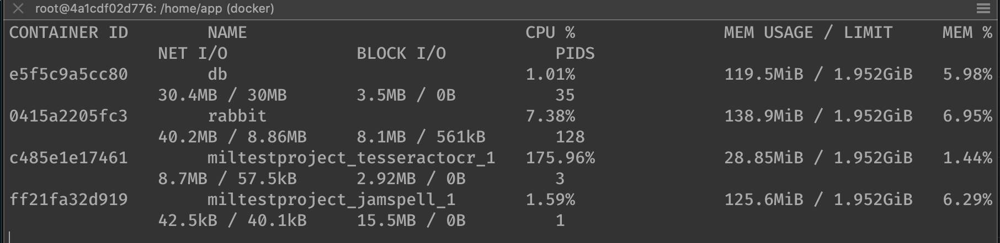
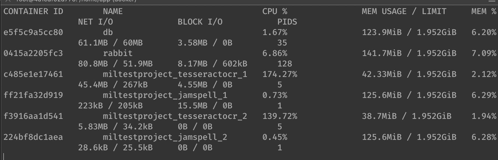
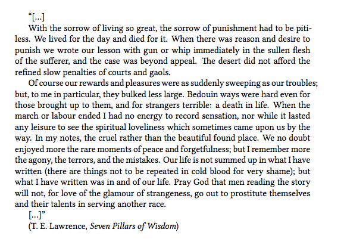

# MIL-OCR

This is the program to recognize text from image.
Text recognizer is based on [tesseract](https://github.com/tesseract-ocr/tesseract) ocr and [jamspell](https://github.com/bakwc/JamSpell) corrector.  

## Installation

To install you must have `docker` on your computer.  

```
pip install -r requirements.txt
docker-compose pull
```

## Usage

In [config file](config.json) one can define which language is going to be recognized on the images using the parameter `"tesseract-language"`.
If the desired language is not English and Russian, then one should also modify the [Docker file](./tesseract/Dockerfile) and rebuild the service.
Languages are mostly defined by three letter language codes, which are accepted by [tesseract](https://github.com/tesseract-ocr/tesseract).
Seems it is not so easy to find the list of languages on the tesseract's site, so here is another [help link](https://askubuntu.com/questions/793634/how-do-i-install-a-new-language-pack-for-tesseract-on-16-04) with somebody's question on askubuntu.com.
Default language is English.

The program processes all images from databyse.  
Start docker containers with workers, queue and db:
```
docker-compose up
```

Put your image in dir `data`. To add images in database run:
```
python text_extractor.py load
```
*Images can be re-added in database and will considered as new and unhandled.*


To process all unhandled images:
```
python text_extractor.py process
```

To clear database:
```
python text_extractor.py clear
```

## Scaling Test

You can change the number of workers for ocr and corrector with command:
```
docker-compose scale pytesseractocr=3
```

And
```
docker-compose scale jamspell=3
```

*3 is an example.*

### Results

Time to process dataset of 411 images:

| n ocr | n corrector | time, s |
|-------|-------------|--------:|
|  1    |     1       |    65.3 |
|  2    |     2       |    36.5 |

#### Single workers resource usage



#### Multiply workers resource usage

 


## Examples

[Dataset description](https://rrc.cvc.uab.es/?ch=1). 
[Download](https://rrc.cvc.uab.es/downloads/Challenge1_Training_Task12_Images.zip). 

#### In:

 

#### Out: 

The special one-day
Apple shopping
Ya

This Friday.

#### In:

 

#### Out: 
Ss

Meaningful
Moments

#### In:

    

#### Out:

With the sorrow of living so great, the sorrow of punishment had to be pit-
less. We lived for the day and died for it. When there was reason and desire to
punish we wrote our lesson with gun or whip immediately in the sullen flesh
of the sufferer, and the case was beyond appeal. The desert did not afford the
refined slow penalties of courts and gaols.

Ofcourse our rewards and pleasures were as suddenly sweeping as our troubles;
but, to me in particular, they bulked less large. Bedouin ways were hard even for
those brought up to them, and for strangers terrible: a death in life. When the
march or labour ended I had no energy to record sensation, nor while it lasted
any leisure to see the spiritual loveliness which sometimes came upon us by the
way. In my notes, the cruel rather than the beautiful found place. We no doubt
enjoyed more the rare moments of peace and forgetfulness; but I remember more
the agony, the terrors, and the mistakes. Our life is not summed up in what Have
written (there are things not to be repeated in cold blood for very shame); but
what I have written was in and of our life. Pray God that men reading the story
will not, for love of the glamour of strangeness, go out to prostitute themselves
and their talents in serving another race.

Ly

(I.E. Lawrence, Seven Pillars of Wisdom)


## Appendix. Containers

If one need to rebuild some service defined in [docker-compose.yml](docker-compose.yml) (eg. after changing something in the source code to make the changes actually work), she may use this command
```
docker-compose build --no-cache <service_name>
```
